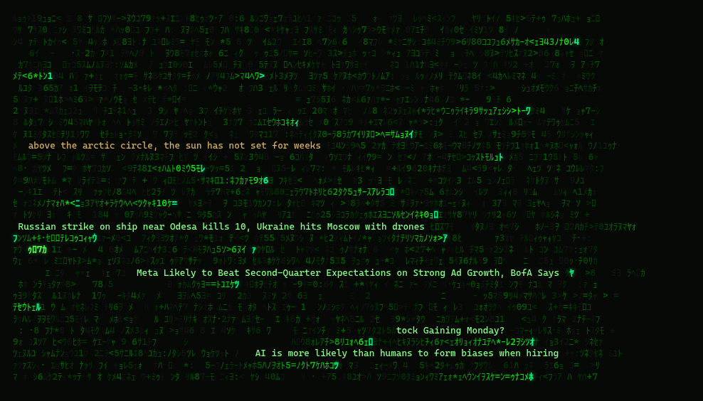
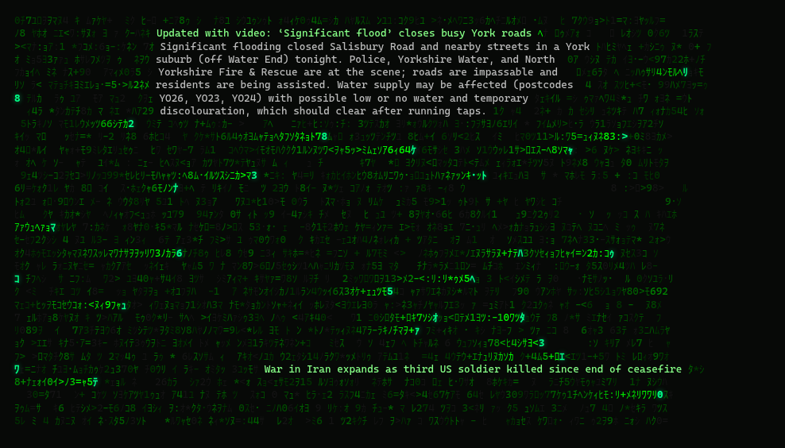
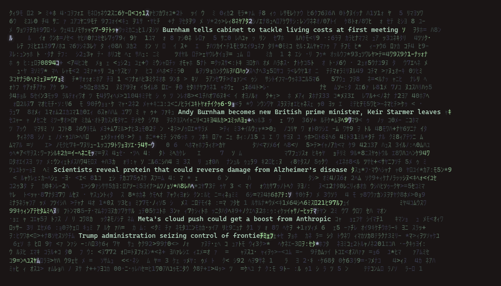

# meanwhile

**Horizontal matrix rain of things happening right now.**

A wall of code sweeps across your terminal. Embedded in the noise — readable
if you look — are real things: live news headlines, local intel for places
you care about, and true, quietly poetic facts about what is happening
somewhere on Earth at this exact moment.



In *The Matrix*, the operators stopped seeing code and started seeing the
world through it. That's the idea: an ambient screen you can actually read.
Glance at it and it's rain; look at it and it's the world.

- **News** — headlines from ordinary **RSS/Atom** feeds (and a couple of free
  public JSON APIs), matched to your topics and places. **Click a headline**
  and its story decodes into the rain as a short blurb; **shift-click** opens
  the article in your browser.
- **Local intel** — tune places (`g`) such as New Zealand, UK, or Japan and
  read national/regional coverage from open feeds (RNZ, Stuff, BBC, NHK, …).
- **Poetic** — true things happening right now, for scale and gratitude:
  live counters, tonight's moon phase, where the sun is rising, seasonal
  lines. Every one is true.
- **Ticker mode** — a separate pure stock marquee (no matrix field). See
  [Ticker mode](#ticker-mode) below.

**Written in Rust** — a single native binary, no Python runtime, low CPU.

## This fork

This is a **Rust port and continuation** of the original project:

- **Original idea & Python prototype:** [Tom Davenport](https://github.com/tomdavenport) —
  [tomdavenport/meanwhile](https://github.com/tomdavenport/meanwhile).  
  Credit where it's due: a lovely ambient concept, and a joy to reimplement.
- **This repository:** [brendan-jarvis/meanwhile](https://github.com/brendan-jarvis/meanwhile)

<details>
<summary><strong>What’s different in this fork</strong></summary>

Compared with the original Python prototype:

- **Rust rewrite** — single native binary, no Python runtime; lower steady-state
  CPU for long-running ambient use (especially multi-pane terminals).
- **RSS/Atom-first news** — headlines from open feeds (plus a few free JSON
  APIs). No search API key required for the rain itself; optional Exa remains
  available only for richer click-to-summarize when configured.
- **Broader place → national feed maps** — more outlets per country/region
  (e.g. RNZ/Stuff, BBC packs, NHK, CBC, …) and Hacker News top-of-day.
- **Feed diagnostics** — `--check-feeds` / verbose fetch logging so broken or
  blocked sources are debuggable.
- **Terminal theme inheritance** — pulls colours from WezTerm, Starship, OSC,
  and Omarchy-style environments instead of a fixed matrix palette only.
- **Pure ticker mode** — `$` / `--ticker`: full-screen S&P 500 marquee with no
  matrix field; session-only toggle (does not stick config on launch).
- **Input / mouse hardening** — cleaner exit from raw mode and mouse tracking;
  shift-click opens the article URL in the browser even when OSC-8 is flaky.
- **Modal occlusion** — help and other panels paint over a frozen rain field
  so glyphs don’t draw through the UI.
- **Performance path** — dirty frame buffer, lower default density/fps options,
  less full-screen redraw work for WezTerm splits and similar PTYs.
- **Prebuilt GitHub Releases** — Linux and macOS archives so people can run
  without a local `cargo build` (Windows via WSL).
- **`--saver`** — cmatrix-style screensaver; any real key or click exits.
- **Update whisper** — optional cached GitHub release check (opt out with
  `check_updates: false` in config).

The original AUR package name (`meanwhile-rain`) and the core ambient idea —
news and poetic lines in horizontal matrix rain — remain the same lineage.

</details>

## Install

### Prebuilt binaries (no Rust / no cargo build)

GitHub **Releases** ship ready-to-run archives. Download, extract, run —
no Rust toolchain and no compile step.

**https://github.com/brendan-jarvis/meanwhile/releases/latest**

Releases are built automatically by GitHub Actions when a version tag
(`v*`) is pushed.

#### Quick install

<details>
<summary><strong>Linux (x86_64 / Intel–AMD)</strong></summary>

```sh
curl -sL https://github.com/brendan-jarvis/meanwhile/releases/latest/download/meanwhile-x86_64-unknown-linux-gnu.tar.gz \
  | tar -xz
chmod +x meanwhile
./meanwhile
```

</details>

<details>
<summary><strong>Linux (ARM64 / aarch64)</strong></summary>

```sh
curl -sL https://github.com/brendan-jarvis/meanwhile/releases/latest/download/meanwhile-aarch64-unknown-linux-gnu.tar.gz \
  | tar -xz
chmod +x meanwhile
./meanwhile
```

</details>

<details>
<summary><strong>macOS (Apple Silicon)</strong></summary>

```sh
curl -sL https://github.com/brendan-jarvis/meanwhile/releases/latest/download/meanwhile-aarch64-apple-darwin.tar.gz \
  | tar -xz
chmod +x meanwhile
./meanwhile
```

</details>

<details>
<summary><strong>macOS (Intel)</strong></summary>

```sh
curl -sL https://github.com/brendan-jarvis/meanwhile/releases/latest/download/meanwhile-x86_64-apple-darwin.tar.gz \
  | tar -xz
chmod +x meanwhile
./meanwhile
```

</details>

<details>
<summary><strong>Windows (via WSL)</strong></summary>

Use [WSL](https://learn.microsoft.com/windows/wsl/) and the **Linux x86_64**
archive (expand that section above). Native Windows builds are not published
yet — the TUI uses Unix terminal APIs.

```sh
# inside WSL:
curl -sL https://github.com/brendan-jarvis/meanwhile/releases/latest/download/meanwhile-x86_64-unknown-linux-gnu.tar.gz \
  | tar -xz
chmod +x meanwhile
./meanwhile
```

</details>

<details>
<summary><strong>Install onto your PATH (optional)</strong></summary>

```sh
mkdir -p ~/.local/bin
mv meanwhile ~/.local/bin/
# ensure ~/.local/bin is on PATH, then:
meanwhile
```

</details>

#### Assets

| Asset | Platform |
|-------|----------|
| `meanwhile-x86_64-unknown-linux-gnu.tar.gz` | Linux Intel/AMD |
| `meanwhile-aarch64-unknown-linux-gnu.tar.gz` | Linux ARM64 |
| `meanwhile-aarch64-apple-darwin.tar.gz` | macOS Apple Silicon |
| `meanwhile-x86_64-apple-darwin.tar.gz` | macOS Intel |

Each archive contains the `meanwhile` binary, `README.md`, and `LICENSE`.

### Build from source

Rust 1.70+ (edition 2021):

```sh
git clone https://github.com/brendan-jarvis/meanwhile.git
cd meanwhile
cargo install --path .
meanwhile
```

Or:

```sh
cargo build --release
./target/release/meanwhile
```

After pulling changes, rebuild so CLI flags match the source.

Arch users may still find an AUR package for the upstream project
(`meanwhile-rain`); packaging files under `packaging/` describe a cargo-based
build if you want to package this fork yourself.

### Cutting a release (maintainers)

```sh
# bump version in Cargo.toml, commit, then:
git tag v0.5.1
git push origin v0.5.1
```

GitHub Actions builds Linux + macOS binaries and attaches them to a new
[Release](https://github.com/brendan-jarvis/meanwhile/releases).

## News & places

Headlines come from **open feeds** — no API key and no AI search for the rain
itself.

**Places** (`g`) map to national outlets, for example:

| place | sources (examples) |
|-------|--------------------|
| New Zealand | RNZ, Stuff |
| Australia | ABC, SBS, SMH |
| UK | BBC, Guardian, Sky, Independent |
| US | NPR, PBS, NYT, Politico |
| Canada | CBC, Globe and Mail |
| Japan | NHK |
| India | Times of India, BBC India |
| China / HK | SCMP, BBC China |
| France / Germany | France 24, DW |
| … | Europe, Middle East, Africa, LatAm packs |

**Topics** (`t`): world, technology, science, business, sport, politics,
culture, or a country name. Technology includes **Hacker News** top-of-list
items via the free Firebase API (not `hnrss/best`, which is a longer-horizon
ranking). Topic `hacker news` / `hn` is HN-only.

Add arbitrary feed URLs with `extra_feeds` in the config. Click decodes the
feed blurb into the rain; an optional [Exa](https://exa.ai) key
(`EXA_API_KEY`) only upgrades that summary. Pass `--offline` for poetic-only.

## Ticker mode

A **separate full-screen mode**: classic scrolling quotes only — **no**
katakana, streams, headlines, or poetic lines.

```sh
# full S&P 500 (~503 names) on the tape
meanwhile --ticker

# lighter half-universe
meanwhile --ticker --symbols SP250

# custom Yahoo symbols
meanwhile --ticker --symbols "AAPL,MSFT,SPY,BTC-USD,FBU.NZ"
```

| behaviour | detail |
|-----------|--------|
| Universe | Default alias **`SP500`** (embedded list). **`SP250`** = first 250 names. Or list symbols explicitly. |
| Layout | Quotes sorted **A→Z**, partitioned **top→bottom** across rows; each symbol on **exactly one** row. |
| Motion | All rows step **together** at **24 fps**. Alternate rows scroll **opposite** directions. |
| Speed (`+` / `-`) | Discrete steps locked to 24 fps (even cells/sec: 1.5, 2, 3, 4, 6, 8, 12, 24). |
| Data | Yahoo Finance spark batches (no API key). Refresh every **10 minutes**; **`r`** forces a pull. |
| Session toggle | **`$`** switches rain ↔ ticker for **this run only** (does not rewrite launch mode). |
| Launch | Plain `meanwhile` → **rain**. `meanwhile --ticker` → tickers. Config `"mode": "ticker"` also starts tickers if set. |

## Keys

| key | action | key | action |
|-----|--------|-----|--------|
| `$` | ticker ↔ rain (session only) | `space` | pause |
| `click` | **decode a story into the rain** | `shift-click` | open article in browser |
| `enter` | pick a story to decode (↑/↓ + enter) | | |
| `t` | edit topics | `g` | edit places (local intel) |
| `f` | focus — surface the text | `n` / `o` | a headline / something true |
| `m` / `p` | toggle news / poetic | `r` | refresh feeds / quotes |
| `+` / `-` | speed | `s` / `d` / `?` | status / feed debug / help |
| `q` | quit | | |

Editors: type + enter adds, `1`–`9` removes, esc closes. Changes persist
and refetch immediately.

## Reading modes

By default text sits **embedded** — a shade above the field, part of the
code. Press `f` for **focus** and headlines surface in full contrast when
you actually want to read the world. The preference sticks.

Click any headline (or press `enter` to pick one) and its story expands
**from that line** into a short summary — you never leave the rain:



## Theming

With `"theme": "auto"` (the default), meanwhile rains in *your* palette:

1. **Live terminal colors** via OSC (WezTerm, kitty, foot, …)
2. **WezTerm config** (`color_scheme` / embedded palette table)
3. **Starship** palette (e.g. Catppuccin Mocha)
4. **Omarchy** active theme, when present

Set `"theme": "matrix"` (or `--theme matrix`) for classic phosphor green.



## Config

`~/.config/meanwhile/config.json`, created on first run:

| key | meaning |
|-----|---------|
| `topics` | what the news follows (also: `t` in-app) |
| `places` | places for local intel (also: `g` in-app) |
| `poetic_ratio` | fraction of lines that are poetic |
| `density`, `speed`, `message_every_seconds` | feel of the rain (density default **0.45**) |
| `fps` | rain redraw rate (default **8**; ticker is fixed at **24**) |
| `focus`, `theme`, `show_source`, `ascii_only` | look |
| `refresh_minutes` | how often to re-pull news feeds |
| `extra_feeds` | extra RSS/Atom URLs to always pull |
| `mode` | `"rain"` (default launch) or `"ticker"` |
| `tickers` | `SP500`, `SP250`, or explicit Yahoo symbols |
| `env_files` | optional paths for `EXA_API_KEY` (summaries only) |
| `mouse` | set `false` to leave the mouse alone |
| `check_updates` | soft GitHub release toast (default **true**; set `false` to opt out) |

`$` does **not** persist `mode` — only an explicit config edit or launching
with a saved `"mode": "ticker"` changes the default launch. Prefer
`meanwhile --ticker` when you want the tape.

Cache and diagnostics live under `~/.cache/meanwhile/` (`headlines.json`,
`last-fetch.log`).

## CLI

```
meanwhile [OPTIONS]

      --offline          poetic lines only, no news fetch
      --ticker           pure stock marquee for this run (no matrix rain)
      --symbols <LIST>   Yahoo symbols / SP500 / SP250 for ticker mode
  -s, --saver            screensaver — any key or click exits
      --ascii            ASCII glyphs (no katakana)
      --topics <TOPICS>  comma-separated topics, overrides config
      --places <PLACES>  comma-separated places for local intel
      --speed <SPEED>    rain speed multiplier
      --theme <THEME>    auto | matrix
  -v, --verbose          log each feed fetch to stderr
      --check-feeds      fetch once, print diagnostics, exit (no TUI)
  -h, --help
  -V, --version
```

```sh
# leave it running on a spare pane — any key wakes
meanwhile --saver
```

### Debugging feeds

```sh
# one-shot NZ check (no rain UI)
meanwhile --check-feeds --places "New Zealand"

# same, with timing lines on stderr
meanwhile --check-feeds -v --places "New Zealand"

# while running: press d for the last fetch log, r to retry
# log file: ~/.cache/meanwhile/last-fetch.log
```

## Notes

- Plain click decodes in-app; **shift-click opens the browser** (handled by
  meanwhile so it works under WezTerm mouse tracking). OSC 8 is still emitted
  as a bonus for terminals that honour it.
- Help and other popups freeze the field — nothing paints through them.
- Rain defaults are tuned for multi-pane use (~8 fps, modest density).
- Every so often — not often — the rain has something to say to you
  directly. If you're impatient, you know whose name to type.

## Performance (Rust fork)

Rough numbers from a release build on Linux/WSL while raining:

| | Typical |
|--|---------|
| **CPU** | ~0.3% of one core |
| **RSS** | ~8–9 MB |
| **Binary** | ~4–5 MB unstripped (~4 MB stripped) |
| **PTY traffic** | tens of KB/s (capped fps + dirty buffer) |

The original Python app was a single ~55 KB stdlib script and already claimed
only ~1–2% CPU — ambient rain was never a number-crunching problem. The costly
part of watching it is almost always **the terminal repainting**, not the
language. This port keeps that load down with a dirty frame buffer, an **8 fps**
rain default, and modest stream density.

**Was the port worth it?** As a pure speed exercise, only a little: same idea,
more build ceremony, a larger artifact than a `.py` file (Python itself still
has to exist on the machine for the script path). As a *product* fork — yes:
one binary with no runtime dependency, RSS-first news without a search API
key, theme inheritance, diagnostics, and a classic ticker mode. The interesting
scorecard is **ship + evolve**, not shaving 1% CPU off drawing characters.

## License

MIT — see [LICENSE](LICENSE). Original copyright Tom Davenport; this fork
continues under the same license.
